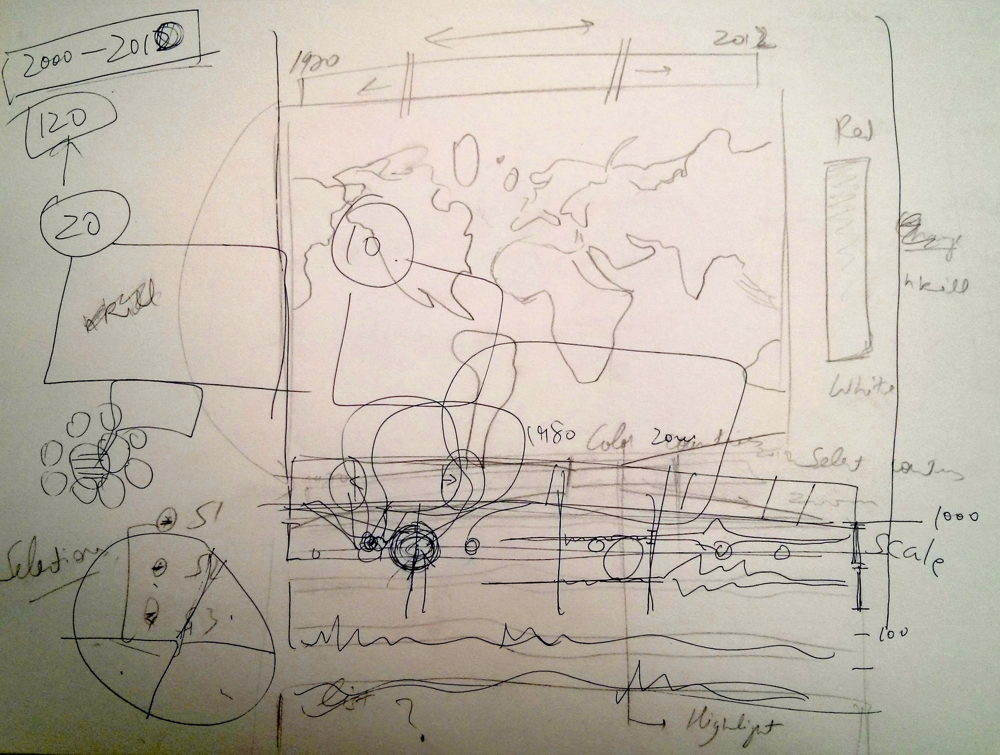
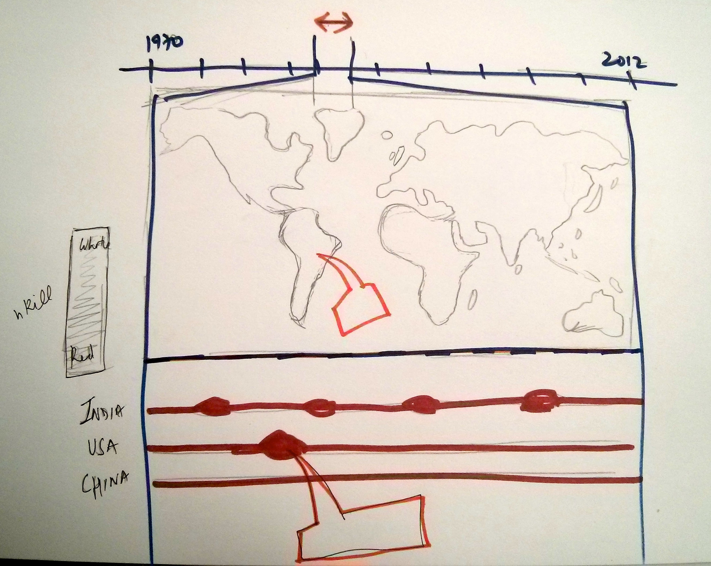

Global Terrorism Visualization
===============

## Team Members

1. Chaoyu Yang <chaoyu@uw.edu>
2. Aniket Handa <aniket@uw.edu>

## Global Terrorism Visualization

####Interaction

The Visualization focuses on discovering important trends and events that shaped the history due to Terrorism. It also tries to make user conscious about the number of unnecessary lives lost due to these unfortunate events. 

We try to accomplish this by showing multiple views of the large dataset - 

* The Global Map view - Shows the world map with color encoded countries according to number of killings over the selected period of time. 
* Country Wise view - Shows circle graphs over the selected period of time. 
* Brushing tool - Shows a bar graph of total killings in every month.

The purpose of all these three views is different. The Map view shows the high level effect on countries due to terrorism, whereas the Country wise view concentrates on comparison, ordering, discovering trends of events between two or more countries, and also it facilitates finding the event which caused the mishap. While these two views focus over a period of time, the Brushing tool helps constantly see the visualization over the full period. It also helps in controlling the other two views.

The visualization features basically three interaction techniques:

_1. Brush:_ 

To brush and link multiple views we use a timeline as a background, which starts from first day of Jan, 2000 to Jan, 2011. It supports 

* Expansion of the current selection in either direction, 
* Dragging of the span over the timeline, and 
* Clicking outside the span selects that particular month.  

_2. Select:_

To afford comparison and trend discovery between event happenings in two or more countries users can select countries by clicking them on the world map. This adds the country to the country wise view of the visualization.

_3. Hover:_

Details on demand - Hovering over a country in the World Map reveals the total number of killings in that country over the period. Also, hovering over a data point in  the country wise view reveals more information about the event w.r.t. to the data point. 

####Dataset
The visualization heavily depends upon dataset acquired from [Global Terrorism Database](http://www.start.umd.edu/gtd) (GTD, University of Maryland). 
>It is currently the most comprehensive unclassified data base on over 113,000 terrorist events, occurred between 1970 and 2012 in the world.

Each event consists information on the date, location, number of people killed and injured, weapons used, intention, group or individual involved, target, summary, cites, etc.

The dataset was cleaned before being directly used. Many required values were `null` or inconsistent. For example, some of the 3 Letter country codes from the database were not matching to that in the [Datamap](http://datamaps.github.io/) object.

## Running Instructions

Access our visualization [here](http://cse512-14w.github.io/a3-chaoyu-aniket/). View it in full screen for better experience.

####OR 

Download this repository and run 

`python -m SimpleHTTPServer 9000` 

at the root and access the visualization from <http://localhost:9000/> using your favorite web browser. 

## Story Board

We started off with data search and found many datasets which called our attention. But before finalizing on one we briefly explored all of them using Tableau.
####Exploration 

* World Map representing countries with more killings (nkill) by more red.

* A time stream representing the trend

* Heat Map of all countries w.r.t. to time, colored according to number of killings.

* Bubble Chart

While exploring these charts using Tableau we also simulated them using pages year wise to evaluate various interactions possible.

####Sketching

* During Brainstorm  

* Final sketch before we started coding

The top portion is a timeline wherein one can select the months from 2000 to 2010. It is used to brush below two visualizations. It affords all the interactions mentioned above.   

#### Changes between Storyboard and the Final Implementation

There are not any significant changes between the final sketch and the final implementation. Though there were some stubble changes in placement of various elements, the colors, the scale used. But, the overall interaction, views and underlining objective remained the same.

* Its hard to sketch colors and exactly understand how they will be perceived without an actual running prototype. We didn't consider the use of log scale for color encoding, until we saw the running visualization.
* We first envisioned the country wise visualization to be similar to time stream from Tableau (above), but we ended up plotting translucent circles with size dependent upon killings to represent each event.

## Development Process

####Work Breakdown
The two member team divided the work as equally as possible and also helped each other out on. Roughly we allocated the tasks as follows:

**_Chaoyu Yang_**

* Data Cleaning
* Implementation of Brushed time scale
* on Brushed event
* Individual Country visualization 

**_Aniket Handa_**

* Dataset Exploration
* World Map implementation and brush integration
* Country selection
* Colors

**_Together_**

* Visualization design and its interaction
* Integration of various features

####Development Process

* The first task was to mutually decide what basic information is needed from the large dataset to produce the designed visualization. The data format was also decided.
* Then, we hopped onto data cleaning and generated CSVs and JSONs of the required data.
* We decided the project into three milestones. First, basic world map representing the data. Second, brushed and linked map. Third, select countries and visualize.
* While, one person was cleaning the data, other was readying the basic front of the world map waiting for the data.
* The next step, after integrating the data with the map, was to implement the brushing feature.
* After this, the country selection feature was implemented.
* Then we briefly worked upon aesthetics and colors of the visualization.
* Finally, we made trend visualization of the selected countries. 

####Technologies used
* D3.js
* [Datamap](http://datamaps.github.io/)
* underscore.js
* Twitter Bootstrap
* jQuery
* Ruby
* Tableau (for exploration)

####Time Spend

Task | ~Time (Individual) | 
------------ | -------------
Data Search | 5-6 hours
Data Exploration | 10-11 hours
Discussing, Designing & Sketching | 15-16 hours
Coding, Cleaning & Learning D3| 25-30 hours 

So, in total we individually spend approximately 60 hours on the assignment.

**Time Consuming Aspects**

- Brainstorming & Designing
- Learning D3
- Data exploration and then cleaning
- Dirty hack to select countries on the Datamap

####Future Work
- Optimize algorithm and queries
- Details on demand about the event, upon hovering on circles
